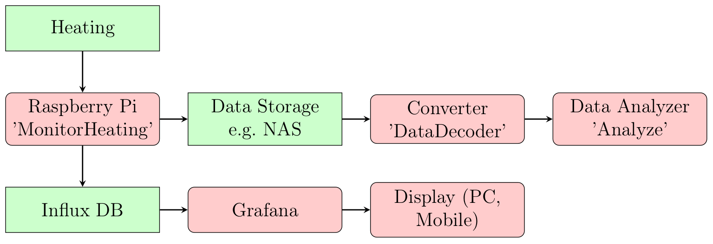

# Data Logger, Converter and Analysis Tool for Luxtronik Heating Control

## System Overview

## System Components
The project consists of three major components and three minor components.

Component      | Classification | Comment
-------------- | -------------- | -------
MonitorHeating | Major          | Reads the data from the Luxtronik control and stores them in binary format and in the Influx DB.
DataDecoder    | Major          | Converts the binary data to CSV
Analyze        | Major          | Does some basic analysis on the CSV files
OctaveScripts  | Minor          | Prints graphs based on the CSV files
Tests          | Minor          | Runs some tests on the MonitorHeating and DataDecoder
Utils          | Minor          | Local time to unix-time converter util
---            | ---            | Extension:
Influx DB      | Major          | Stores the data online to to be used by Grafana _(Not part of this project, see chapter [InfluxDB & Grafana](https://github.com/reto271/DataLoggerHeating_Luxtronik#influx-db--grafana))_
Grafana        | Major          | Visualizes the data online _(Not part of this project, see chapter [InfluxDB & Grafana](https://github.com/reto271/DataLoggerHeating_Luxtronik#influx-db--grafana))_

# MonitorHeating
Uses the command 3004 to read the current data from the Luxtronik heating controller. It takes the IP address as input parameter and reads the data every minute from the controller. The data is stored in binary format. The number of used bits is optimized for each value to minimize the file size. The Common/src/ValueTable.cpp lists the stored values and the corresponding bit-sizes.

The binary files are suitable to backup, since the consume little space.

_I do run the MonitorHeating on a Raspberry Pi Model 2B V1.1. Periodically the data is written to a file server._

# DataDecoder
The data decoder converts the binary data files into CSV files. The CSV files consume more space than the binary files but are more suitable for further processing.

# Analyze
A few python scripts to analyze the data. As input the CSV data is used. You may adapt these scripts for your own purpose.

# Influx DB & Grafana
Extension: The MontitorHeating program writes the data to an Influx data base. The data is online used and visualized by Grafana.

_The data base and Grafana is not part of this project. I do use two distinct Docker containers on my NAS to run InfluxDB and a second for Grafana. If you would like to explore this feature of the MonitorHeating application, setup your own InfluxDB and Grafana. Adapt the IP-Address and the Data Base Name in [MonitorHeating/src/ValueResponse.cpp#L122](https://github.com/reto271/DataLoggerHeating_Luxtronik/blob/b04c6f78e2b2e6b0699e759ffa994c9854ea9e59/MonitorHeating/src/ValueResponse.cpp#L122)._

# Minor Components

## OctaveScripts
An octave script generating a few charts. It displays the warm water and outside temperature. A second chart shows the blocking time and the operating mode of the heating controller.

## Tests
Runs a few google tests on the sources of MonitorHeating and DataDecoder.

## Utils
A util to convert local time to Unix time.

# Acknowledgments
Thanks to Bouni and his documentation on https://github.com/Bouni/Home-Assistant-Luxtronik
Thanks to orca-zhang. I am using the C++ implementation to write InfluxDB (https://github.com/orca-zhang/influxdb-cpp)
May, 2020
